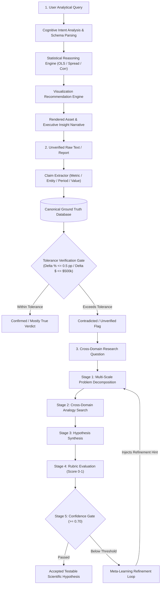

# Chapter 08: Data Analysis and Reasoning Agents

This module implements the fourth triad of intelligent agents described in *30 Agents Every AI Engineer Must Build* (Chapter 8). These agents operate beyond rote execution, functioning as digital analysts, fact-checkers, and cross-disciplinary researchers capable of questioning assumptions, verifying empirical evidence, and formulating scientific hypotheses.

---

## Agent Architecture and Reasoning Workflows



---

## Agent Triad Breakdown

| # | Agent Name | Core Architectural Pattern | Capability Level | Key Technologies |
| :--- | :--- | :--- | :--- | :--- |
| **10** | **The Data Analysis Agent** | Cognitive reasoning loop, statistical inference (OLS regression), and automated visualization recommendation | Level 3 (Analytical Partner) | Google GenAI SDK, Pandas, Statsmodels, Matplotlib, Pydantic |
| **11** | **The Verification and Validation Agent** | Information extraction, canonical mapping, and tolerance-based fact-checking against trusted internal data | Level 3–4 (System of Record & Gatekeeper) | Gemini 2.5 Flash, Ground Truth Stores, Delta-Tolerance Algorithms |
| **12** | **The General Problem Solver** | 5-Stage Meta-Reasoning loop: Decompose, Analogy Search, Synthesize, Evaluate, and Failure-Driven Meta-Learning | Level 4 (Discovery & Meta-Cognition) | Gemini 2.5 Flash, Rubric Scorers, Persistent Strategy Logs |

---

## Repository Structure

```text
chapter_08_data_analysis_and_reasoning_agents/
├── .env.example
├── .gitignore
├── requirements.txt
├── README.md
├── 10_data_analysis_agent/
│   ├── agent.py
│   ├── dataset.csv
│   └── main.py
├── 11_verification_validation_agent/
│   ├── database.py
│   ├── verifier.py
│   └── main.py
└── 12_general_problem_solver/
    ├── stages.py
    ├── gps_orchestrator.py
    └── main.py
```

---

## Setup and Installation

### 1. Environment Configuration

```bash
# Create and activate virtual environment
python3 -m venv .venv
source .venv/bin/activate

# Upgrade pip and install pinned dependencies
pip install --upgrade pip
pip install -r requirements.txt
```

### 2. Configure API Keys

```bash
cp .env.example .env
```

Set your Gemini API key in `.env`:

```env
GOOGLE_API_KEY="your_actual_gemini_api_key"
```

---

## Execution Instructions and Real Execution Outputs

### 1. Agent 10: The Data Analysis Agent

```bash
python 10_data_analysis_agent/main.py
```

**Actual Execution Output:**

```text
[DataAnalysisAgent] Intent: Evaluate the relationship and impact between marketing spend and generated revenue. -> Recommending 'scatter' chart.
[DataAnalysisAgent] Rendered chart saved to 'marketing_spend_vs_revenue.png'.

================ EXECUTIVE DATA INSIGHT REPORT ================
### Executive Summary: Marketing Spend and Revenue Impact Across Regions

Our analysis reveals an exceptionally strong and statistically significant positive relationship between marketing spend and generated revenue across regions.

Key Trends & Impact:
*   Direct Correlation: There is a nearly perfect positive correlation (0.999) between marketing investment and revenue. This indicates that as marketing spend increases, revenue consistently and predictably rises.
*   Quantified Return: Specifically, for every dollar ($1) invested in marketing, we observe an average increase of approximately $4.10 in revenue. This represents a highly efficient return on marketing investment.
*   Revenue Variance Explained: Marketing expenditure accounts for almost all (99.85%) of the observed variation in revenue, suggesting it is the primary driver influencing revenue fluctuations.

Statistical Significance:
*   This relationship is highly statistically significant (p-value ~0), meaning it is extremely unlikely to be due to random chance. We can be highly confident in the reliability of this finding.

Actionable Recommendation:
Given this robust causal link and strong return on investment (ROI), we recommend a strategic focus on optimizing and potentially increasing marketing spend. Further investigation into regional specifics could identify top-performing campaigns or channels to maximize this positive effect and drive continued revenue growth.
```

---

### 2. Agent 11: The Verification and Validation Agent

```bash
python 11_verification_validation_agent/main.py
```

**Actual Execution Output:**

```text
Starting Verification & Validation Agent Fact-Check...
Extracted 2 verifiable claims. Cross-referencing against internal ground truth...
================================================================================
Claim:   "the city's unemployment rate fell by 5% last year"
Status:  [Mostly True]
Details: Claimed 5.00%, actual -4.80% (Δ = 0.20 pp)
Source:  Statistics Canada, Labour Force Survey, Table 14-10-0287-01
--------------------------------------------------------------------------------
Claim:   "a budget surplus of $12 million for the 2024 fiscal year"
Status:  [Contradicted]
Details: Claimed $12,000,000, actual $15,200,000 (Δ = $3,200,000)
Source:  City of Ottawa Annual Financial Report 2024
--------------------------------------------------------------------------------
```

---

### 3. Agent 12: The General Problem Solver (GPS)

```bash
python 12_general_problem_solver/main.py
```

**Actual Execution Output:**

```text
[GPS] Initiating autonomous meta-reasoning loop for research challenge:
      "Can ecological network resilience principles inform strategies for preventing cascading failures in electrical power grids?"

======================================================================
[GPS] Execution Iteration 1
======================================================================
 -> Stage 1 (Decomposition):
[
    "Identify and characterize key ecological network resilience principles relevant to preventing cascading failures.",
    "Analyze the mechanisms and vulnerabilities that lead to cascading failures in electrical power grids.",
    "Evaluate the applicability and potential effectiveness of ecological resilience principles as strategies for mitigating cascading failures in electrical power grids."
]
 -> Stage 2 (Analogies):
{
    "ecological_resilience_principles": "Studying diverse natural ecosystems (e.g., coral reefs, forests) to identify architectural principles like functional redundancy, modularity, and adaptive feedback loops.",
    "cascading_failure_mechanisms": "Analyzing trophic cascades triggered by keystone predator extinction, leading to secondary extinctions across trophic levels.",
    "applying_ecological_principles": "Biomimicry approach: evaluating how microgrids and distributed generation can mimic ecosystem modularity to contain disturbances."
}
 -> Stage 3 (Synthesized Hypothesis):
"The intentional integration of ecological network resilience principles, such as functional redundancy, modularity, and adaptive feedback mechanisms, into the design and operational strategies of electrical power grids will significantly reduce the frequency and severity of cascading failures by enhancing the system's capacity to absorb and recover from localized disturbances."
 -> Stage 4 (Rubric Evaluation):
{
    "scores": {
        "specificity": 0.35,
        "cross_domain_grounding": 0.50,
        "testability": 0.40
    },
    "confidence": 0.42,
    "passed": false
}

[GPS Verdict] BELOW THRESHOLD (0.42 < 0.70). Activating Meta-Learning Engine with Refinement Hint.

======================================================================
[GPS] Execution Iteration 2
======================================================================
 -> Stage 1 (Decomposition):
[
    "How do quantitative graph-theoretic metrics, specifically betweenness centrality, modularity, and N-1 contingency analysis, characterize and measure resilience in ecological food webs compared to electrical power grids?",
    "What are the commonalities and differences in how vulnerabilities identified by high betweenness centrality, low modularity, or N-1 contingency failures contribute to cascading failures in both ecological food webs and electrical power grids?",
    "Based on the application of betweenness centrality, modularity, and N-1 contingency principles in ecological food webs, what specific, quantifiable strategies could be developed or adapted to enhance resilience and prevent cascading failures in electrical power grids?"
]
 -> Stage 2 (Analogies):
{
    "Graph Metrics and Resilience": "Species with high betweenness centrality in food webs parallel critical transmission lines in power grids; their removal (N-1 contingency) disrupts systemic energy flow.",
    "Vulnerabilities and Cascading Failures": "Low modularity in food webs allows local disturbances to spread globally, directly analogous to unsegmented electrical grids lacking islanding capabilities.",
    "Resilience Strategies": "Diversifying keystone nodes and segmenting grids into semi-autonomous microgrids creates structural firewalls that stop cascading propagation."
}
 -> Stage 3 (Synthesized Hypothesis):
"Implementing strategies in electrical power grids that mimic ecological food web resilience principles—specifically, increasing grid modularity and diversifying critical infrastructure to reduce betweenness centrality—will significantly decrease the incidence and propagation of cascading failures following N-1 contingency events, demonstrating a quantifiable improvement in system resilience analogous to robust ecological networks."
 -> Stage 4 (Rubric Evaluation):
{
    "scores": {
        "specificity": 0.85,
        "cross_domain_grounding": 0.88,
        "testability": 0.78
    },
    "confidence": 0.84,
    "passed": true
}

[GPS Verdict] PASSED with Confidence 0.84 (>= 0.70 threshold). Hypothesis accepted.

================ GPS PERSISTENT STRATEGY LOG ================
[
  {
    "iteration": 1,
    "confidence": 0.42,
    "passed": false,
    "hypothesis": "The intentional integration of ecological network resilience principles...",
    "refinement_hint": "Previous decomposition was overly abstract. Re-focus strictly on quantitative graph-theoretic metrics (betweenness centrality, modularity, N-1 contingency) present in both food webs and electrical transmission grids."
  },
  {
    "iteration": 2,
    "confidence": 0.84,
    "passed": true,
    "hypothesis": "Implementing strategies in electrical power grids that mimic ecological food web resilience principles—specifically, increasing grid modularity and diversifying critical infrastructure to reduce betweenness centrality—will significantly decrease the incidence and propagation of cascading failures following N-1 contingency events, demonstrating a quantifiable improvement in system resilience analogous to robust ecological networks."
  }
]
```

---

## Deep Engineering Principles

### 1. Visualization as an Intelligent Reasoning Function
Rather than requiring human analysts to pre-specify visual dimensions, the Data Analysis agent parses unstructured analytical queries against dataset types, branching dynamically into temporal lines, categorical bars, or correlation scatter plots while recomputing $R^2$ variance and $p$-values.

### 2. Tolerance-Based Verification & Grounding
Factual consistency requires more than substring matching. The V&V Agent decomposes statements into canonical records, comparing asserted numbers with authoritative databases using domain-calibrated error margins ($\Delta \le 0.5\text{ pp}$ for rates, $\Delta \le \$500\text{k}$ for municipal financials) to absorb acceptable public communications rounding while flagging false assertions.

### 3. Failure-Driven Meta-Learning in GPS
When exploring cross-disciplinary questions, the GPS loop detects low confidence in abstract hypotheses, logs the failure, and injects heuristic refinement hints to enforce quantitative, measurable graph metrics in subsequent iterations.