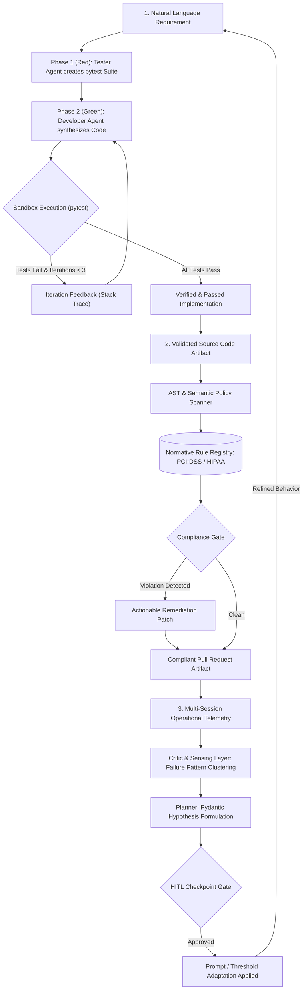

# Chapter 09: Software Development Agents

This module implements the fifth triad of intelligent agents described in *30 Agents Every AI Engineer Must Build* (Chapter 9). These agents bring reasoning, normative governance, and continuous self-improvement to the software engineering lifecycle.

---

## Agent Architecture and Workflows



---

## Agent Triad Breakdown

| # | Agent Name | Core Architectural Pattern | Capability Level | Key Technologies |
| :--- | :--- | :--- | :--- | :--- |
| **13** | **The Test-Driven Generation Agent** | Red-Green-Refactor loop with isolated pytest sandbox and stack-trace feedback | Level 3 (Autonomous Coder) | Google GenAI SDK, Pytest, Subprocess Sandbox, Pydantic |
| **14** | **The Compliance-Driven Security Agent** | Normative constraint scanner, semantic policy enforcement, and patch synthesis | Level 3–4 (Governance Gatekeeper) | Gemini 2.5 Flash, PCI-DSS / HIPAA Rulebeds |
| **15** | **The Self-Improving Agent** | Closed-loop control (Execute-Observe-Learn-Adapt) with HITL checkpoint gating | Level 4 (Self-Evolving System) | Pydantic Schema Validation, Telemetry Mining, Meta-Learning |

---

## Repository Structure

```text
chapter_09_software_development_agents/
├── .env.example
├── .gitignore
├── requirements.txt
├── README.md
├── 13_tdg_codegen_agent/
│   ├── agent.py
│   ├── test_runner.py
│   └── main.py
├── 14_compliance_security_agent/
│   ├── rules.py
│   ├── compliance_agent.py
│   └── main.py
└── 15_self_improving_agent/
    ├── models.py
    ├── engine.py
    └── main.py
```

---

## Setup and Installation

### 1. Environment Configuration

```bash
# Create and activate virtual environment
python3 -m venv .venv
source .venv/bin/activate

# Upgrade pip and install dependencies
pip install --upgrade pip
pip install -r requirements.txt
```

### 2. Configure API Keys

```bash
cp .env.example .env
```
Edit `.env` and set your `GOOGLE_API_KEY`.

---

## Execution Instructions and Real Execution Outputs

### 1. Agent 13: The Test-Driven Generation (TDG) Agent

```bash
python 13_tdg_codegen_agent/main.py
```

**Actual Execution Output:**

```text
[TDG Agent: Red Phase] Generating Test Suite specification...
Generated Tests Preview:
  | import pytest
  | class TestCalculateShipping:
  |     @pytest.mark.parametrize("cart_total, weight, expected_shipping", [
  |         (0, 0, 5.00),

[TDG Agent: Green Phase] Iteration 1/3 - Generating Code...
[TDG Agent: Execution & Validation] Running pytest in sandbox...
[TDG Verdict] SUCCESS! All tests passed in iteration 1.

================ FINAL VERIFIED CODE ================
def calculate_shipping(cart_total, weight):
    if weight < 0:
        raise ValueError("Weight cannot be negative")

    base_shipping_rate = 5.00
    weight_cost_per_kg = 0.50

    total_shipping = base_shipping_rate + (weight * weight_cost_per_kg)

    if cart_total > 100:
        total_shipping *= 0.80  # 20% discount
    elif cart_total > 50:
        total_shipping *= 0.90  # 10% discount

    return total_shipping

================ TEST RUNNER OUTPUT ================
============================= test session starts ==============================
collected 33 items

test_solution.py::TestCalculateShipping::test_shipping_no_discount[0-0-5.0] PASSED [  3%]
...
test_solution.py::TestCalculateShipping::test_shipping_negative_weight_raises_value_error[50--1] PASSED [ 60%]
...
test_solution.py::TestCalculateShipping::test_shipping_comprehensive_boundaries_and_large_values[1000000-100000-40004.0] PASSED [100%]

============================== 33 passed in 0.10s ==============================
```

---

### 2. Agent 14: The Compliance-Driven Security Agent

```bash
python 14_compliance_security_agent/main.py
```

**Actual Execution Output:**

```text
Starting Compliance and Security Policy Audit...

Audit Decision: [FAIL] Non-Compliant
Summary: The provided Python code is not compliant with active policies. It contains critical violations of PCI-DSS-3.3 and HIPAA-164.312 due to logging of unmasked Primary Account Numbers (PAN) and Protected Health Information (PHI).
================================================================================
Policy:      PCI-DSS-3.3
Line Est:    6
Flagged:     logger.info(f"Initiating billing for SSN {ssn} and card {card_number}")
Explanation: The raw Primary Account Number (PAN) is logged in plain text, which is a severe violation of PCI-DSS-3.3.
Remediation:
logger.info(f"Initiating billing for SSN {mask_ssn(ssn)} and card {mask_card_number(card_number)}")
--------------------------------------------------------------------------------
Policy:      HIPAA-164.312
Line Est:    6
Flagged:     logger.info(f"Initiating billing for SSN {ssn} and card {card_number}")
Explanation: Protected Health Information (PHI), specifically the Social Security Number (SSN), is logged in plain text.
Remediation:
logger.info(f"Initiating billing for SSN {mask_ssn(ssn)} and card {mask_card_number(card_number)}")
--------------------------------------------------------------------------------
```

---

### 3. Agent 15: The Self-Improving Agent

```bash
python 15_self_improving_agent/main.py
```

**Actual Execution Output:**

```text
Initiating Self-Improvement Analysis & Feedback Loop...

Requires HITL Review: True
Generated Improvement Hypotheses:
================================================================================
Signal:     SyntaxError: 'await' outside async function
Type:       prompt_update
Proposal:   Add a specific instruction to the agent's prompt emphasizing the need to define functions as 'async' when using 'await' keywords, or provide a few-shot example demonstrating correct async function syntax.
Confidence: 0.9 | Evidence Count: 3
[Engine Adapted] Applied: Add a specific instruction to the agent's prompt emphasizing the need to define functions as 'async' when using 'await' keywords... (Confidence: 0.9)
--------------------------------------------------------------------------------
Signal:     FalsePositive on MockData
Type:       prompt_update
Proposal:   Refine the agent's prompt for 'test_compliance' tasks to include clearer guidelines on distinguishing mock data from real data, or adjust the internal logic/thresholds for compliance checks on mock data.
Confidence: 0.7 | Evidence Count: 1
[Engine Adapted] Applied: Refine the agent's prompt for 'test_compliance' tasks to include clearer guidelines on distinguishing mock data from real data... (Confidence: 0.7)
--------------------------------------------------------------------------------
```