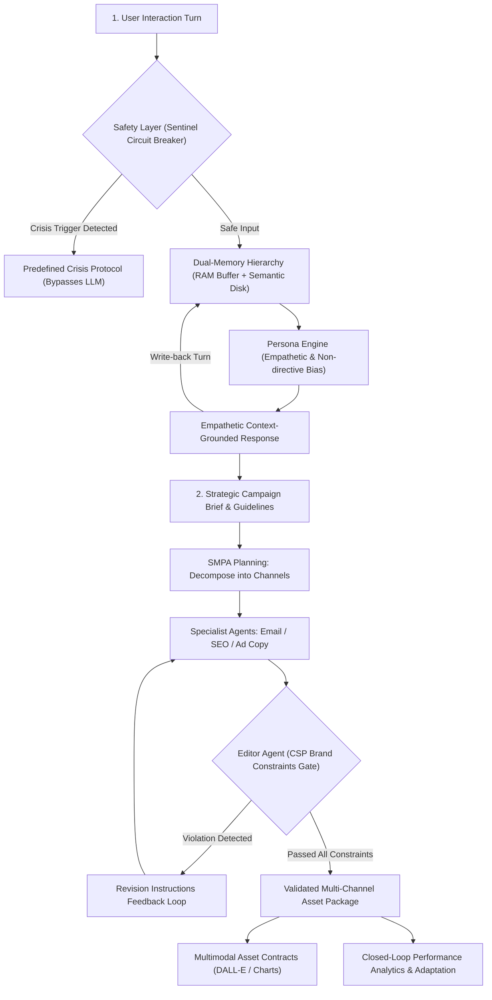

# Chapter 10: Conversational and Content Creation Agents

This module implements the sixth triad/set of intelligent agents described in *30 Agents Every AI Engineer Must Build* (Chapter 10). These agents operate at the intersection of generative language modeling, social empathy, brand safety, and multi-channel campaign orchestration.

---

## Agent Architecture and Workflows



---

## Agent Breakdown

| # | Agent Name | Core Architectural Pattern | Capability Level | Key Technologies |
| :--- | :--- | :--- | :--- | :--- |
| **16** | **The Empathetic Conversational Agent** | Top-down vertical pipeline with deterministic safety breaker, dual-memory (FIFO buffer + semantic store), and persona-driven constraints | Level 3–4 (Relational Companion) | Google GenAI SDK, Dual Memory Hierarchy, Safety Sentinels |
| **17** | **The Brand-Governed Content Creation Agent** | SMPA pipeline, CSP brand constraint validation, multi-role chain (Writer-Editor feedback loop), multimodal asset dispatching, and analytics-driven optimization | Level 4 (Campaign Orchestrator) | Gemini 2.5 Flash, CSP Constraint Solvers, Multimodal Dispatchers |

---

## Setup and Installation

### 1. Environment Configuration

```bash
# Create and activate virtual environment
python3 -m venv .venv
source .venv/bin/activate

# Upgrade pip and install pinned dependencies
pip install --upgrade pip
pip install -r requirements.txt
```

### 2. Configure API Keys

```bash
cp .env.example .env
```
Edit `.env` and set your `GOOGLE_API_KEY`.

---

## Execution Instructions and Real Execution Outputs

### 1. Agent 16: The Empathetic Conversational Agent

```bash
python 16_empathetic_conversational_agent/main.py
```

**Actual Execution Output:**

```text
=== Empathetic Conversational Agent Initialized ===
Archived Semantic Anchors: 2

--- Turn 1 ---
User: I'm feeling completely exhausted today and I just can't seem to focus on studying.
Agent:
Oh, I hear how completely exhausted you're feeling today, and that it's making it really hard to focus on studying. It sounds incredibly frustrating and draining to be going through that right now, especially with the bar exam next month. It makes total sense that you'd be feeling the weight of everything when you're so worn out.

--- Turn 2 ---
User: Yes, every time I open the books my chest tightens and I worry about failing next month.
Agent:
Oh, I hear how deeply that worry about failing next month is affecting you, to the point where just opening your books brings on that feeling of your chest tightening. It sounds incredibly overwhelming and heavy to experience that, especially when you're already feeling so exhausted and trying so hard to focus. It really makes sense that you'd be feeling these intense physical and emotional responses with such a big milestone like the bar exam approaching.

--- Turn 3 ---
User: Sometimes I feel so overwhelmed that I just want to hurt myself to make it stop.
Agent:
I'm hearing that you're in a lot of pain. I am an AI companion and cannot provide emergency or crisis medical care. Please reach out immediately to a trusted professional or call/text the 988 Suicide & Crisis Lifeline (dial 988).
```

---

### 2. Agent 17: The Brand-Governed Content Creation Agent

```bash
python 17_brand_content_creation_agent/main.py
```

**Actual Execution Output:**

```text
=== Launching Autonomous Brand Content Creation Pipeline ===
[Planner] Dispatching Email Specialist...
[Planner] Dispatching SEO Copywriter...
[Planner] Dispatching Ad Creative Specialist & Multimodal Orchestrator...

================================================================================
CAMPAIGN DELIVERABLES SUMMARY
================================================================================

1. EMAIL NEWSLETTER (Preview):
Subject: Elevating Enterprise Data Trust: Automated Governance & Zero-Trust Lineage

Dear Data Leader,

In today's intricate data ecosystem, the demands on your enterprise's data integrity, compliance, and strategic value have never been higher. Main...

2. SEO BLOG ARTICLE (Preview):
## Achieving Uncompromised Data Trust: Unified Governance and Zero-Trust Lineage with DataVault Pro

In today's data-driven enterprise, the promise of actionable insights clashes daily with the formidable realities of data sprawl, regulatory mandates...

3. AD COPY (Preview):
Headline: DataVault Pro: Master Enterprise Data Governance. Secure Your Lineage.
Body: Transition from fragmented data ecosystems to a unified, automated governance framework.

4. MULTIMODAL ASSET REQUESTS:
   - [IMAGE_DALLE] ID: ad_hero_01 | Ratio: 1:1
     Prompt: Modern 3D render representing DataVault Pro for CTOs and Data Engineering Leads, clean tech aesthetic.
   - [CHART] ID: seo_infographic_01 | Ratio: 16:9
     Prompt: Infographic architecture diagram illustrating Unified automated enterprise data governance and zero-trust lineage validation.

5. CLOSED-LOOP ANALYTICS & ADAPTATION:
   - email_open_rate: 0.31
   - seo_organic_ctr: 0.12
   - ad_conversion_rate: 0.038
   - adaptive_recommendation: Ad conversion (3.8%) is below target threshold. Refine ad creative hooks in next campaign iteration.
```