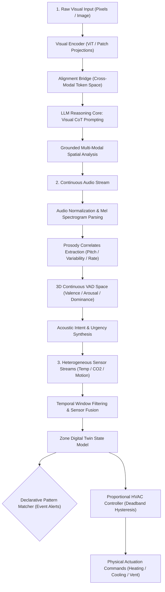

# Chapter 11: Multi-Modal Perception Agents

This module implements the seventh triad of intelligent agents described in *30 Agents Every AI Engineer Must Build* (Chapter 11). These agents extend perception beyond text into pixel arrays, audio waveforms, and asynchronous physical sensor streams.

---

## Agent Architecture and Workflows



---

## Agent Breakdown

| # | Agent Name | Core Architectural Pattern | Capability Level | Key Technologies |
| :--- | :--- | :--- | :--- | :--- |
| **18** | **The Vision-Language Agent** | Direct pixel alignment with visual chain-of-thought (CoT) grounding | Level 3–4 (Visual Reasoner) | Google GenAI SDK, PIL, Vision Transformer Concepts |
| **19** | **The Audio Processing & Voice Sentiment Agent** | Spectral normalization and continuous Valence-Arousal-Dominance (VAD) prosodic mapping | Level 3–4 (Acoustic Analyst) | NumPy, Prosody Extraction, VAD Emotional Modeling |
| **20** | **The Physical World Sensing Agent** | Digital Twin, temporal sensor fusion, declarative event patterns, and proportional HVAC control with deadband | Level 4 (Cyber-Physical Orchestrator) | Temporal Filtering, Control Theory (Proportional Gain & Hysteresis) |

---

## Setup and Installation

### 1. Environment Configuration

```bash
# Create and activate virtual environment
python3 -m venv .venv
source .venv/bin/activate

# Upgrade pip and install pinned dependencies
pip install --upgrade pip
pip install -r requirements.txt
```

### 2. Configure API Keys

```bash
cp .env.example .env
```
Edit `.env` and set your `GOOGLE_API_KEY`.

---

## Execution Instructions and Real Execution Outputs

### 1. Agent 18: Vision-Language Perception Agent

```bash
python 18_vision_language_agent/main.py
```

**Actual Execution Output:**

```text
=== Vision-Language Perception Agent ===
Analyzing: .../18_vision_language_agent/sample_workspace.png
Question:  Is there any object in an unstable or risky position on the desk? Describe the spatial relationship.
======================================================================
Visual CoT Reasoning:
1. The image displays a brown desk surface. 2. On the left side of the desk, there is a dark grey object resembling a laptop, which appears to be fully supported by the desk. 3. On the right side of the desk, there is a white rectangular object. 4. Placed on top of this white rectangular object is a red object, which looks like a cup or mug, with a handle visible on its right side. 5. Upon closer inspection of the red cup, a significant portion of its base, particularly the right side where the handle is located, extends beyond the right edge of the white rectangular object it is resting on. This overhang indicates that the cup is not fully supported by the white object.

Definitive Grounded Answer:
Yes, the red cup is in an unstable or risky position. Its right side, including the handle, significantly overhangs the right edge of the white rectangular object it is placed upon, meaning its base is not fully supported and it could easily tip or fall.
```

---

### 2. Agent 19: Audio Processing & Voice Sentiment Agent

```bash
python 19_audio_processing_agent/main.py
```

**Actual Execution Output:**

```text
=== Audio Processing & Voice Sentiment Agent ===
Processing incoming customer support voice stream...

1. PROSODIC ACOUSTIC & VAD ANALYSIS:
   - Detected State: Frustrated / Agitated
   - VAD Coordinates: Valence=-0.75, Arousal=0.88, Dominance=0.82
   - Mean Pitch: 235.0 Hz | Speaking Rate: 5.8 wps

2. SYNTHESIZED ACTIONABLE RESOLUTION:
   - Cleaned Transcript: "I have called three times today already and my enterprise server is still completely down!"
   - Urgency Score:      0.95 / 1.0
   - Recommended Action: Immediate escalation to critical incident management
```

---

### 3. Agent 20: Physical World Sensing & Smart Building Agent

```bash
python 20_physical_world_sensing_agent/main.py
```

**Actual Execution Output:**

```text
=== Physical World Sensing & Smart Building Agent ===
Executing Sense-Model-Plan-Act Cognitive Cycles across Building Digital Twin...

===========================================================================
ZONE: ZONE-SERVER-01 (server_room)
Fused Digital Twin State: Temp=81.5°F, CO2=450 ppm, Occupancy=False

Active Alerts:
  * [CRITICAL] Critical server room thermal spike in ZONE-SERVER-01: 81.5°F!

Actuator Dispatches (Closed-Loop Proportional Control):
  -> Dispatch hvac_cooling @ 100.0% power
===========================================================================

===========================================================================
ZONE: ZONE-OFFICE-4B (office)
Fused Digital Twin State: Temp=72.0°F, CO2=1250 ppm, Occupancy=True

Active Alerts:
  * [WARNING] Air quality degraded in ZONE-OFFICE-4B: CO2 at 1250 ppm exceeds threshold.

Actuator Dispatches (Closed-Loop Proportional Control):
  -> Dispatch ventilation_intake @ 65.0% power
===========================================================================
```