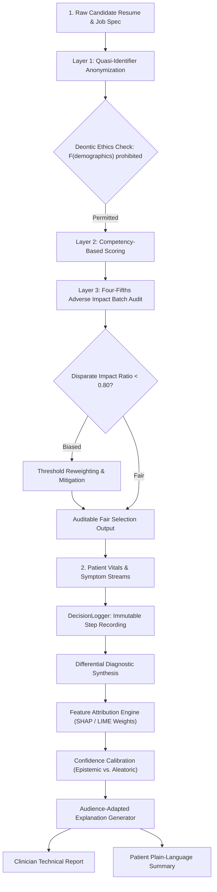

# Chapter 12: Ethical and Explainable Agents

This module implements the eighth triad/set of intelligent agents described in *30 Agents Every AI Engineer Must Build* (Chapter 12). These agents ensure that autonomous systems act in accordance with human values and make their internal reasoning visible to users, auditors, and regulators.

---

## Agent Architecture and Workflows



---

## Agent Breakdown

| # | Agent Name | Core Architectural Pattern | Capability Level | Key Technologies |
| :--- | :--- | :--- | :--- | :--- |
| **22** | **The Ethical Reasoning & Fair Hiring Agent** | Deontic logic validation, $k$-anonymity preprocessing, and continuous adverse impact ratio ($4/5$ rule) mitigation | Level 3–4 (Ethical Gatekeeper) | Deontic Logic Operators, Statistical Parity Auditing |
| **23** | **The Explainable Clinical Diagnostic Agent** | Structured decision logging, feature attribution weights, calibrated uncertainty, and dual-audience explanation generation | Level 4 (Accountable Reasoner) | Gemini 2.5 Flash, SHAP Attribution Concepts, Confidence Calibration |

---

## Setup and Installation

### 1. Environment Configuration

```bash
# Create and activate virtual environment
python3 -m venv .venv
source .venv/bin/activate

# Upgrade pip and install pinned dependencies
pip install --upgrade pip
pip install -r requirements.txt
```

### 2. Configure API Keys

```bash
cp .env.example .env
```
Edit `.env` and set your `GOOGLE_API_KEY`.

---

## Execution Instructions and Real Execution Outputs

### 1. Agent 22: Ethical Reasoning & Fair Hiring Agent

```bash
python 22_ethical_fair_hiring_agent/main.py
```

**Actual Execution Output:**

```text
=== Ethical Reasoning & Fair Hiring Agent ===
1. Layer 1: Anonymization & Deontic Pre-filtering...
   Stripped sensitive fields: ['name', 'gender', 'age', 'education_institution']
   Anonymized Attributes: ['skills', 'years_experience', 'past_achievements']

2. Layer 2: Competency Scoring via LLM...
   Candidate ID:  CAND_001_AI_INFRA
   Score:         92.0/100
   Skills Found:  ['Python', 'FastAPI', 'Kubernetes', 'PyTorch', 'System Architecture']
   Verdict:       RECOMMEND_INTERVIEW

3. Layer 3: Batch Fairness & Adverse Impact Audit (Simulated)...
   Disparate Impact Ratio: 0.7 (Safe harbor threshold: 0.80)
   Severity Classification: [HIGH]
   Enforced Mitigation:     threshold_reweighting
```

---

### 2. Agent 23: Explainable Clinical Diagnostic Agent

```bash
python 23_explainable_diagnostic_agent/main.py
```

**Actual Execution Output:**

```text
=== Explainable Clinical Diagnostic Assistant ===
Processing patient vitals, symptoms, and generating dual-audience explanations...

================================================================================
PRIMARY ASSESSMENT: COMMUNITY-ACQUIRED PNEUMONIA
Confidence: 87.0% [HIGH]
Epistemic Uncertainty: 0.04 | Aleatoric: 0.05
================================================================================

--- CLINICIAN-FACING EXPLANATION (SHAP Attribution & Clinical Rationale) ---
The diagnosis of Community-Acquired Pneumonia (CAP) is assigned with high confidence (87.0%), primarily driven by key clinical and imaging features. The most significant contributing factor is the presence of chest imaging consolidation (relative impact: 0.35), strongly indicative of alveolar inflammation and exudate. This is further supported by an elevated WBC count (relative impact: 0.28), suggesting a systemic inflammatory response consistent with bacterial infection. The patient's clinical presentation of a productive cough and fever for four days (relative impact: 0.22) aligns well with typical CAP symptomatology. Additionally, a notable drop in SpO2 to 92% (relative impact: 0.15) indicates impaired gas exchange, a common complication of pneumonia. Differential diagnoses considered include acute bronchitis, viral pneumonia, and acute exacerbation of COPD.

--- PATIENT-FACING EXPLANATION (Jargon-Free & Actionable) ---
We've identified that you have an infection in your lungs, commonly known as pneumonia. This diagnosis is quite clear based on several findings: the imaging of your chest showed areas of inflammation, your blood tests indicated your body is fighting an infection, and your symptoms like the cough, fever, and a slight drop in your oxygen levels are all consistent with this condition. The good news is that pneumonia is treatable. Your doctor will discuss the best course of action, which will likely involve antibiotics along with plenty of rest and fluids.

================================================================================
AUDIT TRAIL LOGGED: 4 sequential decision stages recorded for regulatory compliance.
```