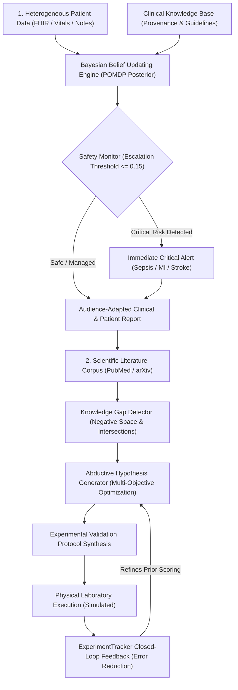

# Chapter 13: Healthcare and Scientific Agents

This module implements the ninth triad/set of intelligent agents described in *30 Agents Every AI Engineer Must Build* (Chapter 13). These agents operate under high-stakes conditions where safety, verifiability, provenance, and continuous closed-loop learning are paramount.

---

## Agent Architecture and Workflows



---

## Agent Breakdown

| # | Agent Name | Core Architectural Pattern | Capability Level | Key Technologies |
| :--- | :--- | :--- | :--- | :--- |
| **24** | **The Healthcare Intelligence Agent** | 4-layer isolation (FHIR ingestion, provenance knowledge base, Bayesian POMDP belief update, deterministic safety monitor) | Level 4 (Clinical Decision Partner) | Google GenAI SDK, FHIR Models, Bayesian Updating, Safety Monitors |
| **25** | **The Scientific Discovery Agent** | Information-theoretic gap detection, abductive hypothesis generator, and closed-loop experimental tracking (*ExperimentTracker*) | Level 4 (Autonomous Scientific Partner) | Gemini 2.5 Flash, Abductive Reasoning, Closed-Loop Feedback |

---

## Setup and Installation

### 1. Environment Configuration

```bash
# Create and activate virtual environment
python3 -m venv .venv
source .venv/bin/activate

# Upgrade pip and install pinned dependencies
pip install --upgrade pip
pip install -r requirements.txt
```

### 2. Configure API Keys

```bash
cp .env.example .env
```
Edit `.env` and set your `GOOGLE_API_KEY`.

---

## Execution Instructions and Real Execution Outputs

### 1. Agent 24: Healthcare Intelligence Agent

```bash
python 24_healthcare_intelligence_agent/main.py
```

**Actual Execution Output:**

```text
=== Healthcare Intelligence Agent Initialized ===
Ingesting FHIR record for patient: PAT-9842-EMERGENCY...

================================================================================
PRIMARY CLINICAL DIAGNOSIS: SEPSIS WITH CONCURRENT PNEUMONIA
Bayesian Posterior Distribution: {'sepsis': 0.417, 'pneumonia': 0.417, 'other_viral': 0.167}
================================================================================

[SAFETY MONITOR STATUS] Escalation Required: True
Escalation Flag:   SEPSIS
Clinical Rationale: Estimated risk of SEPSIS is 41.7%, exceeding safety threshold (15.0%).

--- CLINICIAN-FACING ACTIONABLE DIRECTIVE ---
STAT medical emergency. Patient PAT-9842-EMERGENCY presents with signs consistent with severe infection and potential sepsis (Temp 39.1°C, HR 112 bpm, BP 92/58 mmHg, SpO2 91%, rigors, lethargy, productive green sputum). Given the estimated risk of Sepsis at 41.7% exceeding the safety threshold, immediate escalation is required. Per Surviving Sepsis Campaign (v2024.1) guidelines, initiate Sepsis 1-hour bundle: 1. Obtain two sets of blood cultures (aerobic and anaerobic) immediately. 2. Draw serum lactate level. 3. Administer broad-spectrum intravenous antibiotics within 1 hour...

--- PATIENT-FACING PLAIN LANGUAGE SUMMARY ---
You are experiencing a serious infection that is making your body very sick. Your high fever, fast heart rate, low blood pressure, and difficulty breathing are concerning. We believe you have a severe lung infection, like pneumonia, and your body is reacting strongly to it, which we call sepsis...

[AUDIT & PROVENANCE] Backed by Surviving Sepsis Campaign v2024.1
```

---

### 2. Agent 25: Scientific Discovery Agent

```bash
python 25_scientific_discovery_agent/main.py
```

**Actual Execution Output:**

```text
=== Scientific Discovery Agent Initialized ===
Initiating autonomous literature gap mining for: 'High-temperature aerospace flexible polymers'...

================================================================================
1. TARGET KNOWLEDGE GAP IDENTIFIED [GAP-MAT-01]
   Domain:        Aerospace Polymer Chemistry (cross_domain_intersection)
   Description:  Intersection of rigid aromatic polyimides (thermal stability >350°C) with block copolymer elastomer segments (mechanical elongation >15%).
   Novelty:      92% | Feasibility: 85%
================================================================================

2. ABDUCTIVE HYPOTHESIS FORMULATION [HYP-MAT-01-PI-PDMS]
   Title:        Aromatic Polyimide-Polydimethylsiloxane (PI-PDMS) Block Copolymer
   Rationale:    The proposed aromatic polyimide-polydimethylsiloxane (PI-PDMS) block copolymer is designed to bridge the knowledge gap by leveraging the distinct properties of its constituent blocks...
   Novelty:      While PI-PDMS block copolymers have been explored, achieving the precise balance of a glass transition temperature consistently above 350°C and an elongation at break exceeding 15% within a well-defined block copolymer architecture, specifically tailored for aerospace applications, remains a significant challenge...

3. EXPERIMENTAL PROTOCOL & IN-SILICO PREDICTIONS:
   Procedure:    1. Synthesis of Poly(amic acid) (PAA) precursor... 2. Functionalization of PDMS... 3. Block Copolymer Synthesis... 4. Imidization...
   Techniques:   ['Differential Scanning Calorimetry (DSC)', 'Dynamic Mechanical Analysis (DMA)', 'Thermogravimetric Analysis (TGA)', 'Tensile Testing (ASTM D882)', 'Fourier-Transform Infrared Spectroscopy (FTIR)', 'Nuclear Magnetic Resonance (NMR)', 'Small-Angle X-ray Scattering (SAXS)']
   Predictions:  [PropertyPrediction(property_name='glass_transition_temp_c', predicted_value=365.0), PropertyPrediction(property_name='elongation_at_break_pct', predicted_value=18.0), PropertyPrediction(property_name='thermal_decomposition_temp_5pct_weight_loss_c', predicted_value=500.0)]

================================================================================
4. CLOSED-LOOP PHYSICAL LAB MEASUREMENT & EVALUATION
================================================================================
   Measured Lab Results: {'glass_transition_temp_c': 358.0, 'elongation_at_break_pct': 16.2}
   Prediction Errors:    {'glass_transition_temp_c': 1.96, 'elongation_at_break_pct': 11.11}
```