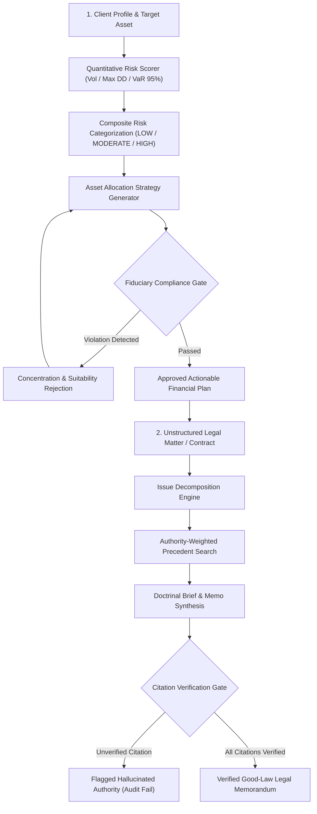

# Chapter 14: Financial and Legal Domain Agents

This module implements the tenth triad/set of intelligent agents described in *30 Agents Every AI Engineer Must Build* (Chapter 14). These agents operate under strict regulatory oversight where recommendations must be mathematically justifiable, compliant with statutory policies, and rigorously verifiable against authoritative precedent.

---

## Agent Architecture and Workflows



---

## Agent Breakdown

| # | Agent Name | Core Architectural Pattern | Capability Level | Key Technologies |
| :--- | :--- | :--- | :--- | :--- |
| **26** | **The Financial Advisory Agent** | Multi-dimensional quantitative risk scoring (VaR 95%, Volatility, Drawdown) and fiduciary compliance validation gate | Level 4 (Fiduciary Decision Partner) | Google GenAI SDK, NumPy, Quantitative Risk Models, Fiduciary Gates |
| **27** | **The Legal Intelligence Agent** | Hierarchical authority-weighted retrieval, issue extraction, contract clause risk matrix, and citation verification gate | Level 4 (Legal Research Partner) | Gemini 2.5 Flash, Citation Verification Gates, Contract Clause Analyzers |

---

## Setup and Installation

### 1. Environment Configuration

```bash
# Create and activate virtual environment
python3 -m venv .venv
source .venv/bin/activate

# Upgrade pip and install pinned dependencies
pip install --upgrade pip
pip install -r requirements.txt
```

### 2. Configure API Keys

```bash
cp .env.example .env
```
Edit `.env` and set your `GOOGLE_API_KEY`.

---

## Execution Instructions and Real Execution Outputs

### 1. Agent 26: Financial Advisory Agent

```bash
python 26_financial_advisory_agent/main.py
```

**Actual Execution Output:**

```text
=== Financial Advisory Agent Initialized ===
Generating personalized, compliant investment plan for Client ID: RETAIL-CL-8841...

================================================================================
STRATEGY: MODERATE GROWTH & INCOME PORTFOLIO
Expected Annualized Return: 0.07%
Composite Risk Score: 2.7/10 [LOW] (Vol: 19.72%, Max DD: -13.32%)
================================================================================

1. RECOMMENDED ASSET ALLOCATION:
   - US Equities                     :  30.0%
   - International Equities          :  25.0%
   - Diversified Fixed Income        :  35.0%
   - Real Estate (REITs)             :  10.0%

2. COMPLIANCE GATE STATUS:
   [APPROVED] Recommendation satisfies all regulatory suitability and concentration limits.

3. FIDUCIARY RATIONALE & DISCLOSURES:
   Rationale:  This portfolio is designed for a client with a moderate risk tolerance and a long-term investment horizon of 10 years, aligning with the primary goal of long-term capital appreciation for retirement...
   Disclosure: Investing in securities involves risks, including the potential loss of principal. Past performance is not indicative of future results...
```

---

### 2. Agent 27: Legal Intelligence Agent

```bash
python 27_legal_intelligence_agent/main.py
```

**Actual Execution Output:**

```text
=== Legal Intelligence Agent Initialized ===
Conducting legal research and brief preparation for: 'Ninth Circuit'...

================================================================================
LEGAL RESEARCH MEMORANDUM
================================================================================
Matter Summary: Client, an e-commerce marketplace operator, faces a lawsuit in California federal court initiated by a foreign competitor alleging improper online data extraction. The core legal questions concern the court's personal jurisdiction over the client and the applicable standard of care under Ninth Circuit precedent for the alleged data extraction.

1. DECOMPOSED LEGAL ISSUES:
   [PJ-1] Does the California federal court have specific personal jurisdiction over the client, an e-commerce marketplace, in a suit brought by a foreign competitor alleging improper online data extraction?
       Doctrine: Specific personal jurisdiction; minimum contacts; purposeful availment.
   [SOC-1] What standard of care applies under Ninth Circuit precedent for claims of improper online data extraction?
       Doctrine: Duty of care; tort liability.

2. DOCTRINAL SYNTHESIS & ANALYSIS:
Regarding personal jurisdiction (Issue PJ-1), the Ninth Circuit's precedent in Doe v. Ninth Circuit Tech Corp, 818 F.3d 920, establishes that minimum contacts can be found in e-commerce disputes when commercial transactions specifically target forum residents...

Concerning the standard of care for improper online data extraction (Issue SOC-1), none of the provided verified precedents directly address a specific standard of care for such claims under Ninth Circuit law. The available precedents, Miranda v. Arizona, 384 U.S. 436, pertains to Fifth Amendment rights, and Kyllo v. United States, 533 U.S. 27, relates to Fourth Amendment searches. Doe v. Ninth Circuit Tech Corp, 818 F.3d 920, exclusively deals with personal jurisdiction...

3. CITATION VERIFICATION GATE REPORT:
   Total Citations Extracted:    1
   Verified Good-Law Authorities: 1
   Verification Status:          [PASS] Fully Verified
   Citation Quality Score:       100%

4. STRATEGIC RECOMMENDATION:
For the personal jurisdiction challenge, counsel should meticulously gather evidence demonstrating the extent to which the client's e-commerce marketplace either did or did not specifically target California residents for commercial transactions...

================================================================================
CONTRACT CLAUSE RISK AUDIT DEMO
================================================================================
Clause:        Indemnification Clause
Risk Level:    [LOW]
Risk Details:  Standard commercial terms conforming to routine boilerplate.
Proposed Fix:  No amendment required.
```