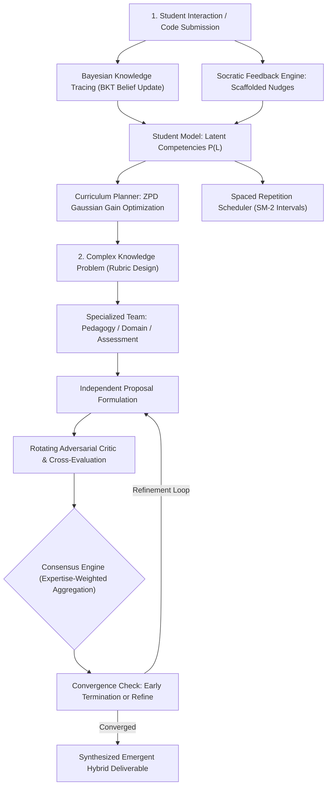

# Chapter 15: Education and Knowledge Agents

This module implements the eleventh triad/set of intelligent agents described in *30 Agents Every AI Engineer Must Build* (Chapter 15). These agents master adaptive human learning and orchestrate emergent collective consensus among specialized problem-solving reasoners.

---

## Agent Architecture and Workflows



---

## Agent Breakdown

| # | Agent Name | Core Architectural Pattern | Capability Level | Key Technologies |
| :--- | :--- | :--- | :--- | :--- |
| **28** | **The Education Intelligence Agent** | POMDP approximation via BKT belief updating, Vygotsky ZPD curriculum planning, SM-2 spaced repetition, and Socratic feedback | Level 4 (Adaptive Pedagogical Partner) | Google GenAI SDK, Bayesian Updating, SM-2 Spaced Repetition |
| **29** | **The Collective Intelligence Agent** | Multi-agent structured consensus, rotating adversarial critic, expertise-weighted aggregation, and emergent synthesis | Level 4 (Collaborative Decision Ensemble) | Gemini API, Social Choice Theory, Condorcet Voting Mechanics |

---

## Setup and Installation

### 1. Environment Configuration

```bash
# Create and activate virtual environment
python3 -m venv .venv
source .venv/bin/activate

# Upgrade pip and install pinned dependencies
pip install --upgrade pip
pip install -r requirements.txt
```

### 2. Configure API Keys

```bash
cp .env.example .env
```
Edit `.env` and set your `GOOGLE_API_KEY`.

---

## Execution Instructions and Real Execution Outputs

### 1. Agent 28: Education Intelligence Agent

```bash
python 28_education_intelligence_agent/main.py
```

**Actual Execution Output:**

```text
=== Education Intelligence Agent Initialized ===
Student: ALEX-904

1. CURRICULUM PLANNING (ZPD & Prerequisite Analysis):
   * [loop_iteration] For/While Loop Iteration (Difficulty: 0.45 | Current Mastery: 0.25 | ZPD Score: 1.3)

2. STUDENT INTERACTION & SOCRATIC FEEDBACK ON 'loop_iteration':
   [Praise]      You correctly initialized the accumulator variable and set up the conditional modulo check for even numbers.
   [Localize]    Notice the placement of your `break` statement inside the loop relative to the order of operations.
   [Question]    When the very first element evaluated is negative, does your current loop structure stop before or after it has inspected other values?
   [Hint Level]  Level 2/4

3. BAYESIAN KNOWLEDGE TRACING (BKT) BELIEF UPDATE:
   Skill: loop_iteration | Prior P(L): 0.25 --> Updated P(L): 0.12

4. SPACED REPETITION (SM-2 RETENTION SCHEDULING):
   Retrieved successfully with guidance: Next review in 6 days (Ease factor: 2.36)
```

---

### 2. Agent 29: Collective Intelligence Agent

```bash
python 29_collective_intelligence_agent/main.py
```

**Actual Execution Output:**

```text
=== Collective Intelligence Agent Initialized ===
Problem: Design a grading rubric for an introductory Python assignment: 'Implement a function `merge_sorted_lists(list1, list2)` that returns a new sorted list containing all elements from both input lists in non-decreasing order without using Python's built-in `sort()` or `sorted()`.'

Executing Multi-Agent Proposal, Cross-Critique, and Consensus Deliberation...
  [Round 1/2] Generating proposals and rotating adversarial critic...
  [Round 2/2] Generating proposals and rotating adversarial critic...
  [Synthesis Phase] Facilitator synthesizing final hybrid rubric...

================================================================================
COLLECTIVE CONSENSUS RESULT
================================================================================
Rounds Executed:     2
Consensus Score:     8.5 / 10.0
Convergence State:   CONVERGED

--- SYNTHESIZED HYBRID RUBRIC ---
### Final Synthesized Grading Rubric: `merge_sorted_lists`

| Criterion | Weight | Scoring Levels (0 / 1 / 2 pts) |
| :--- | :--- | :--- |
| **1. Algorithmic Integrity** | 35% | 0: Uses forbidden `sort()`/`sorted()`<br>1: Custom approach with ordering flaws<br>2: Fully deterministic two-pointer non-decreasing merge |
| **2. Edge Case Coverage** | 30% | 0: Crashes on empty lists or duplicates<br>1: Handles empty input only<br>2: Successfully tests empty lists, duplicate elements, and differing input lengths |
| **3. Computational Efficiency** | 20% | 0: Exceeds $O(N+M)$ complexity<br>1: Sub-optimal indexing<br>2: Linear $O(N+M)$ time and clean single-pass space usage |
| **4. Code Readability & Formative Style** | 15% | 0: Uncommunicative syntax<br>1: Partial documentation<br>2: Descriptive variable names, clean indentation, and docstring |
```