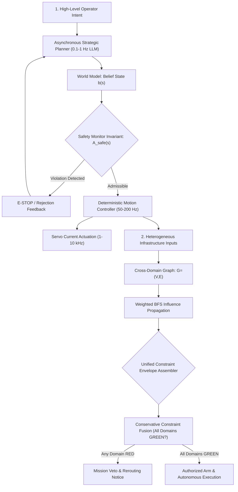

# Chapter 16: Embodied and Physical World Agents

This module implements the final set of intelligent agents from *30 Agents Every AI Engineer Must Build* (Chapter 16). These agents operate under the **physicality constraint**: actions carry mass, latency, energy limits, and irreversibility. The architecture addresses both **depth** (real-time deterministic physical control) and **breadth** (cross-domain infrastructure coordination).

---

## Agent Architecture and Workflows



---

## Agent Breakdown

| # | Agent Name | Core Architectural Pattern | Capability Level | Key Technologies |
| :--- | :--- | :--- | :--- | :--- |
| **30** | **The Embodied Intelligence Agent (Depth)** | Multi-rate asymmetric control loop ($0.1\text{--}1\text{ Hz}$ planning vs $50\text{--}200\text{ Hz}$ control), belief state $b(s)$ POMDP updates, and strict $\mathcal{A}_{\text{safe}}(s)$ validation | Level 4 (Embodied Physical Reasoner) | Google GenAI SDK, POMDP Belief State, Safety Invariant Monitors |
| **31** | **The Domain-Transforming Integration Agent (Breadth)** | Heterogeneous cross-domain dependency graph, BFS influence propagation with attenuation, and conservative Unified Constraint Envelope fusion | Level 4 (Cross-Domain Infrastructure Supervisor) | Gemini API, Multi-source Constraint Fusion, Influence Attenuation |

---

## Setup and Installation

### 1. Environment Configuration

```bash
# Create and activate virtual environment
python3 -m venv .venv
source .venv/bin/activate

# Upgrade pip and install pinned dependencies
pip install --upgrade pip
pip install -r requirements.txt
```

### 2. Configure API Keys

```bash
cp .env.example .env
```
Edit `.env` and set your `GOOGLE_API_KEY`.

---

## Execution Instructions and Real Execution Outputs

### 1. Agent 30: Embodied Intelligence Agent (Depth Architecture)

```bash
python 30_embodied_intelligence_agent/main.py
```

**Actual Execution Output:**

```text
=== Embodied Intelligence Agent Initialized (Depth Architecture) ===
High-Level Operator Goal: 'Move package A to shelf B without colliding with obstacles or violating workspace bounds.'

1. DECOMPOSING TASK INTO PARAMETERIZED PHYSICAL ACTIONS:
   Step 1: MOVE   -> (1.2, 0.4, 0.3) | Move the robot's end-effector to a pre-grasp position directly above Package A to prepare for grasping.
   Step 2: GRASP  -> (1.2, 0.4, 0.1) | Descend and grasp Package A at its current location.
   Step 3: MOVE   -> (2.5, 1.8, 1.4) | Move Package A to a pre-placement position directly above Shelf B, ensuring clearance during transit.
   Step 4: PLACE  -> (2.5, 1.8, 1.2) | Descend and place Package A onto Shelf B.
   Step 5: HALT   -> (2.5, 1.8, 1.2) | Task completed. Maintain current position.

2. EXECUTING IN REAL-TIME CONTROL LOOP WITH SAFETY ENFORCEMENT:
   Step 1: [EXECUTED] MOVE (1.2, 0.4, 0.3) (Lat: 45.0ms)
   Step 2: [EXECUTED] GRASP (1.2, 0.4, 0.1) (Lat: 45.0ms)
   Step 3: [EXECUTED] MOVE (2.5, 1.8, 1.4) (Lat: 45.0ms)
   Step 4: [EXECUTED] PLACE (2.5, 1.8, 1.2) (Lat: 45.0ms)
   Step 5: [EXECUTED] HALT (2.5, 1.8, 1.2) (Lat: 45.0ms)

3. SAFETY INVARIANT INTERRUPT DEMO (Human worker steps within 0.8m):
   [HALT] MOVE -> Human worker within safety perimeter (0.80m < 1.0m). E-STOP engaged.
```

---

### 2. Agent 31: Domain-Transforming Integration Agent (Breadth Architecture)

```bash
python 31_domain_integration_agent/main.py
```

**Actual Execution Output:**

```text
=== Domain-Transforming Integration Agent (Breadth Architecture) ===
Evaluating Mission Corridor: CENTERPOINTE_TO_OTTAWA_RIVER (Ottawa Winter Operation)

1. CROSS-DOMAIN DEPENDENCY INFLUENCE PROPAGATION (Source: 'Subzero_Weather'):
   * Node: Subzero_Weather            | Impact: 100.0% | Path: Subzero_Weather
   * Node: Battery_Discharge_Rate     | Impact:  85.0% | Path: Subzero_Weather -> Battery_Discharge_Rate
   * Node: Flight_Duration_Budget     | Impact:  76.5% | Path: Subzero_Weather -> Battery_Discharge_Rate -> Flight_Duration_Budget

2. UNIFIED CONSTRAINT ENVELOPE (Nominal Winter Flight Case):
   Unified Envelope Green: True
   Go / No-Go Decision:    [ARM_AND_EXECUTE]
     [OK] Weather (Temp > -10C)               : Ambient: -6.2°C
     [OK] Weather (Wind < 25 km/h)            : Wind: 18.5 km/h
     [OK] Battery (Departure SoC >= 30%)      : SoC: 82%
     [OK] Airspace (Transport Canada NOTAMs)  : Active NOTAMs: 0
     [OK] Parks Canada Greenbelt Clearance    : Authorized: True

3. CONSERVATIVE CONSTRAINT FUSION REJECTION DEMO (Extreme Cold: -11.5°C):
   Unified Envelope Green: False
   Go / No-Go Decision:    [REJECT_MISSION]
     [VETO TRIGGERED] Weather (Temp > -10C): Ambient: -11.5°C
```